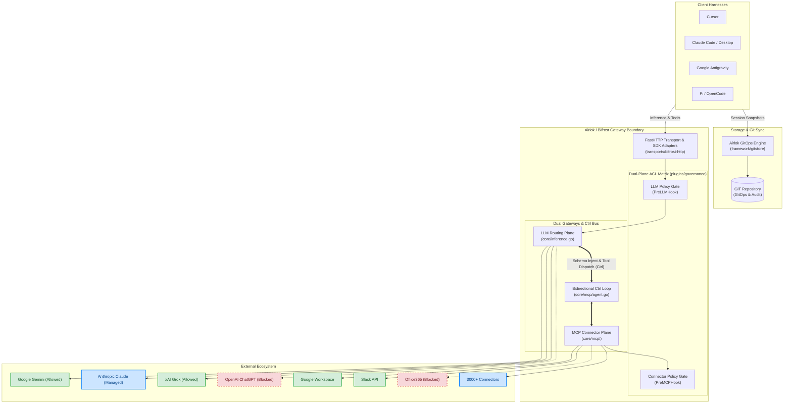

# Phase 2: Architectural Plan — Airlok on Bifrost Platform

**Persona**: Systems Engineer  
**Status**: Proposed / Approved  
**Date**: 2026-10-05  
**Base Repository**: `github.com/maximhq/bifrost`  
**Intake Reference**: `.spec/01_intake/intake_raw.md`  

---

## 1. High-Level System Architecture & Component Mapping

---

## 2. Component Implementation Architecture

### 2.1 Dual-Plane ACL Plugin (`plugins/governance/acl.go`)
Bifrost's plugin architecture provides exact interception points for our dual-plane ACL:
- **`PreLLMHook`**: Called before any LLM provider receives a request.
  - Checks caller virtual key or session against `LLMPolicies`.
  - Allowed: Gemini (`gemini-*`), Grok (`grok-*`).
  - Managed / Audit: Claude (`claude-*`).
  - Blocked: OpenAI ChatGPT (`gpt-*`, `o1-*`, `o3-*`) $\to$ returns `LLMPluginShortCircuit` with HTTP 403 Forbidden fail-closed.
- **`PreMCPHook`**: Called before any tool or connector is executed by the agent loop.
  - Checks target tool name and connector source against `ConnectorPolicies`.
  - Allowed: Google Workspace (`google_*`), Slack (`slack_*`).
  - Blocked: Office365 (`office365_*`) $\to$ returns short-circuit rejection.
- **`CrossPlane` Validation**: Prevents data loaded from internal connectors (Google Workspace) from being piped to external/blocked LLMs.

### 2.2 Harness Adapter & OAuth Endpoints (`transports/bifrost-http/handlers/harness.go`)
- `GET /api/v1/harness/config`: Returns optimal environment variable presets for Cursor, Claude Code, Antigravity, and Pi.
- `GET /api/v1/harness/oauth/login`: Initiates loopback OAuth PKCE flow on `http://127.0.0.1:8765/callback` for developer workstation authentication.
- `POST /api/v1/harness/storage/checkpoint`: Commits workspace state and session checkpoints to Git.

### 2.3 GitOps Syncer (`framework/gitstore/git_syncer.go`)
- Debounced Git commit engine (minimum interval 5s, prevents git lock contention).
- Pre-commit secret scanner: rejects commits containing OAuth tokens (`ya29.`, `xoxb-`, `gho_`).

### 2.4 Pre-Packaged Connectors (`recipes/connectors/`)
- Declarative MCP connector definitions for Google Workspace, Slack, and Office365 to load into Bifrost's MCP Client Manager.

---

## 3. Verification Strategy
1. **Unit Tests**:
   - `plugins/governance/acl_test.go`: Test allow/deny logic for LLMs and Connectors.
   - `framework/gitstore/git_syncer_test.go`: Test debouncing and secret leak prevention.
2. **Integration Tests**:
   - Test harness router endpoints via HTTP client.
   - Test LLM short-circuit when calling blocked models (OpenAI ChatGPT) returning 403.
   - Test MCP short-circuit when invoking blocked connectors (Office365).
3. **Build Commands**:
   - `make build-cli LOCAL=1`
   - `cd transports/bifrost-http && go build -o ../../tmp/bifrost-http .`
