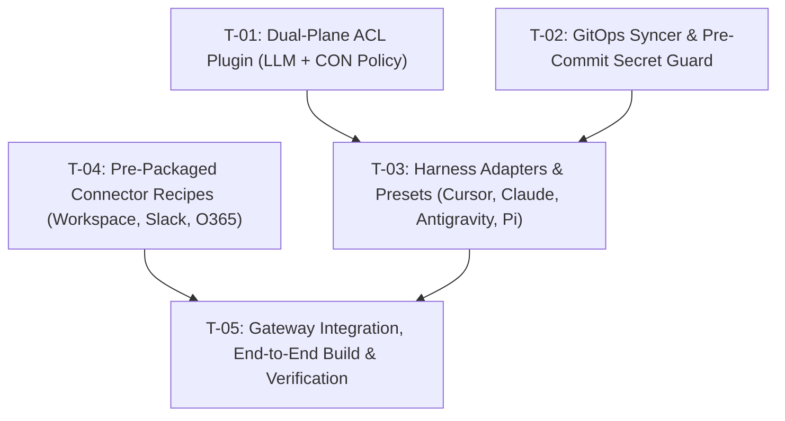

# Phase 4: Teamwork Execution Manifest — Airlok on Bifrost

**Persona**: Orchestration Lead  
**Status**: Ready for Execution  
**Date**: 2026-10-05  
**Base Repository**: `github.com/maximhq/bifrost`  
**Spec References**:  
- Intake: `.spec/01_intake/intake_raw.md`
- Architecture: `.spec/02_planning/architectural_plan.md`
- Hardened Mitigations: `.spec/03_grill/mitigation_plan.md`

---

## 1. Execution Task Matrix

| Task ID | Component / Track | Target Files | Verification Command | Status |
|---|---|---|---|---|
| **T-01** | Dual-Plane ACL Plugin | `plugins/governance/acl.go`, `plugins/governance/acl_test.go` | `cd plugins/governance && go test -v -run TestDualPlaneAcl` | **Completed** |
| **T-02** | GitOps Syncer & Secret Guard | `framework/gitstore/git_syncer.go`, `framework/gitstore/git_syncer_test.go` | `cd framework && go test -v ./gitstore/...` | **Completed** |
| **T-03** | Harness Adapters & Endpoints | `transports/bifrost-http/handlers/airlok_harness.go`, `airlok_harness_test.go` | `cd transports/bifrost-http && go test -v ./handlers -run TestAirlokHarness` | **Completed** |
| **T-04** | Pre-Packaged Connector Recipes | `recipes/connectors/google_workspace.json`, `slack.json`, `office365.json`, `airlok_policy.json` | Validate JSON Schema | **Completed** |
| **T-05** | Gateway Integration & Build | `transports/bifrost-http/server/server.go`, `plugins.go` | `make build-cli LOCAL=1 && cd transports/bifrost-http && go build -o ../../tmp/bifrost-http .` | **Completed** |

---

## 2. Multi-Agent Dependency Graph

---

## 3. Acceptance Criteria
- [x] **AC-1**: `DualPlaneACL` blocks OpenAI ChatGPT models with HTTP 403, audits Claude, allows Gemini and Grok.
- [x] **AC-2**: `DualPlaneACL` blocks Office365 MCP tool calls, allows Slack and Google Workspace.
- [x] **AC-3**: `GitSyncer` prevents committing secret tokens and debounces rapid commits.
- [x] **AC-4**: `/api/v1/airlok/harness/config` delivers valid configuration presets for Cursor, Claude Code, Antigravity, and Pi.
- [x] **AC-5**: Both `bifrost` CLI and `bifrost-http` server compile cleanly with zero errors.
