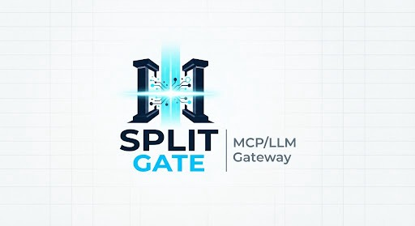

<p align="center">
  
</p>

# Splitgate — High-Performance Enterprise MCP & LLM Gateway

<p align="center">
  <strong>Unified gateway for 23+ LLM providers, Model Context Protocol (MCP) tool execution, and enterprise security controls with sub-15µs overhead.</strong>
</p>

<p align="center">
  <a href="https://github.com/tysongoulding/splitgate"></a>
  <a href="https://github.com/tysongoulding/splitgate/blob/dev/LICENSE"></a>
  <a href="https://github.com/tysongoulding/splitgate"></a>
  <a href="https://github.com/tysongoulding/splitgate"></a>
</p>

## The fastest way to build enterprise AI & MCP applications that never go down

Splitgate is a high-performance AI and Model Context Protocol (MCP) gateway that unifies access to 23+ providers (OpenAI, Anthropic, AWS Bedrock, Google Vertex, and more) through a single OpenAI-compatible API. Deploy in seconds with zero configuration and get automatic failover, adaptive load balancing, semantic caching, and full enterprise security controls.

## Quick Start


**Go from zero to production-ready AI gateway in under a minute.**

**Step 1:** Start Bifrost Gateway

```bash
# Install and run locally
npx -y @maximhq/bifrost

# Or use Docker
docker run -p 8080:8080 maximhq/bifrost
```

**Step 2:** Configure via Web UI

```bash
# Open the built-in web interface
open http://localhost:8080
```

**Step 3:** Make your first API call

```bash
curl -X POST http://localhost:8080/v1/chat/completions \
  -H "Content-Type: application/json" \
  -d '{
    "model": "openai/gpt-4o-mini",
    "messages": [{"role": "user", "content": "Hello, Bifrost!"}]
  }'
```

**That's it!** Your AI gateway is running with a web interface for visual configuration, real-time monitoring, and analytics.

**Complete Setup Guides:**

- [Gateway Setup](https://docs.getbifrost.ai/quickstart/gateway/setting-up) - HTTP API deployment
- [Go SDK Setup](https://docs.getbifrost.ai/quickstart/go-sdk/setting-up) - Direct integration

---

## Splitgate Enterprise Capabilities

Splitgate delivers production-grade enterprise extensions on top of the ultra-fast core gateway:

| Enterprise Capability | Technology / Architecture | Key Highlights |
|---|---|---|
| **Content Guardrails Pipeline** | In-Process RE2, CEL & Adapters | Sub-millisecond evaluation, PII anonymization, streaming split-token hold buffer, AWS/Azure/GCP adapters, synchronous HTTP 422 blocking. |
| **High-Availability Cluster Mode** | Memberlist SWIM & gRPC | Peer auto-discovery on port 10101, gRPC state replication on port 10102, 7-lane broker relay, deterministic leader failover. |
| **Zero-Drift Distributed Rate Limiting** | P2P Token Bucket & Consistent Hash | Forwarding RPC key affinity, gossip delta sync, Lua Redis coordination, verified 0 drift under 1,000-goroutine bursts. |
| **Adaptive Load Balancing & Circuit Breakers** | Peak EWMA & 4-Tier Health FSM | Latency exponential decay, error penalty, 4 health states (`Healthy`, `Degraded`, `Held`, `Dead`), held-keys backoff, automatic failover. |
| **Enterprise SSO (SAML 2.0 & OIDC)** | RS256 JWKS & XML Digests | Okta, Entra ID, Google Workspace, Keycloak support, atomic key replacement on rotation, race-free JIT user provisioning, SCIM 2.0. |
| **Dynamic Secret Vault Integrations** | Multi-Cloud Vault Drivers | HashiCorp Vault KV v2, AWS Secrets Manager, GCP Secret Manager, multi-tenant paths, TTL cache, circuit-breaker stale fallback, cache flush API. |
| **Federated MCP Tool Governance** | RFC 8693 Token Exchange & Dual-Plane ACL | Virtual `/mcp/{slug}` endpoints, per-user tool visibility, subject token deduplication, cross-plane boundary leak prevention. |
| **Automated Log Streaming & Offloading** | Multi-Trigger Batched Queue | S3/GCS payload offloader for payloads >32KB, zero-retention Datadog streaming exporter, high-throughput non-blocking worker pools. |
| **Tamper-Evident Audit Ledger** | Cryptographic HMAC-SHA256 Chains | Merkle-linked audit blocks, sequence monotonicity checks, tail truncation detection, GDPR client IP scrubbing. |
| **Granular RBAC & Diagnostics** | FastHTTP Middleware & SLA Bundles | 17-resource RBAC matrix across 4 system roles (`Admin`, `Developer`, `Security Auditor`, `Operator`), rolling P50/P90/P99 latency tracking, bounded `.tar.gz` diagnostic bundles. |

---

## Key Features

### Core Infrastructure

- **[Unified Interface](https://docs.getbifrost.ai/providers/supported-providers/overview)** - Single OpenAI-compatible API for all providers
- **[Multi-Provider Support](https://docs.getbifrost.ai/quickstart/gateway/provider-configuration)** - OpenAI, Anthropic, AWS Bedrock, Google Vertex, Azure, Cerebras, Cohere, Mistral, Ollama, Groq, and more
- **[Automatic Fallbacks](https://docs.getbifrost.ai/features/retries-and-fallbacks)** - Seamless failover between providers and models with zero downtime
- **[Load Balancing](https://docs.getbifrost.ai/features/retries-and-fallbacks)** - Intelligent request distribution across multiple API keys and providers

### Advanced Features

- **[Model Context Protocol (MCP)](https://docs.getbifrost.ai/mcp/overview)** - Enable AI models to use external tools (filesystem, web search, databases)
- **[Semantic Caching](https://docs.getbifrost.ai/features/semantic-caching)** - Intelligent response caching based on semantic similarity to reduce costs and latency
- **[Multimodal Support](https://docs.getbifrost.ai/quickstart/gateway/streaming)** - Support for text, images, audio, and streaming, all behind a common interface.
- **[Custom Plugins](https://docs.getbifrost.ai/enterprise/custom-plugins)** - Extensible middleware architecture for analytics, monitoring, and custom logic
- **[Governance](https://docs.getbifrost.ai/features/governance/virtual-keys)** - Usage tracking, rate limiting, and fine-grained access control

### Enterprise & Security

- **[Budget Management](https://docs.getbifrost.ai/features/governance/budget-and-limits)** - Hierarchical cost control with virtual keys, teams, and customer budgets
- **[User Provisioning (OIDC)](https://docs.getbifrost.ai/enterprise/user-provisioning)** - OAuth 2.0 / OIDC login with background directory sync for teams, roles, and business units
- **[Observability](https://docs.getbifrost.ai/features/observability/default)** - Native Prometheus metrics, distributed tracing, and comprehensive logging
- **[Secrets Management](https://docs.getbifrost.ai/deployment-guides/config-json#environment-variable-references)** - Secure API key management with environment variables and deployment secrets

### Developer Experience

- **[Zero-Config Startup](https://docs.getbifrost.ai/quickstart/gateway/setting-up)** - Start immediately with dynamic provider configuration
- **[Drop-in Replacement](https://docs.getbifrost.ai/features/drop-in-replacement)** - Replace OpenAI/Anthropic/GenAI APIs with one line of code
- **[SDK Integrations](https://docs.getbifrost.ai/integrations/what-is-an-integration)** - Native support for popular AI SDKs with zero code changes
- **[Configuration Flexibility](https://docs.getbifrost.ai/quickstart/gateway/provider-configuration)** - Web UI, API-driven, or file-based configuration options

---

## Repository Structure

Bifrost uses a modular architecture for maximum flexibility:

```text
bifrost/
├── npx/                 # NPX script for easy installation
├── core/                # Core functionality and shared components
│   ├── providers/       # Provider-specific implementations (OpenAI, Anthropic, etc.)
│   ├── schemas/         # Interfaces and structs used throughout Bifrost
│   └── bifrost.go       # Main Bifrost implementation
├── framework/           # Framework components for data persistence
│   ├── configstore/     # Configuration storage backends
│   ├── logstore/        # Request logging storage backends
│   └── vectorstore/     # Vector storages
├── transports/          # HTTP gateway and other interface layers
│   └── bifrost-http/    # HTTP transport implementation
├── ui/                  # Web interface for HTTP gateway
├── plugins/             # Extensible plugin system
│   ├── governance/      # Budget management and access control
│   ├── jsonparser/      # JSON parsing and manipulation utilities
│   ├── logging/         # Request logging and analytics
│   ├── maxim/           # Maxim's observability integration
│   ├── mocker/          # Mock responses for testing and development
│   ├── semanticcache/   # Intelligent response caching
│   └── telemetry/       # Monitoring and observability
├── docs/                # Documentation and guides
└── tests/               # Comprehensive test suites
```

---

## Getting Started Options

Choose the deployment method that fits your needs:

### 1. Gateway (HTTP API)

**Best for:** Language-agnostic integration, microservices, and production deployments

```bash
# NPX - Get started in 30 seconds
npx -y @maximhq/bifrost

# Docker - Production ready
docker run -p 8080:8080 -v $(pwd)/data:/app/data maximhq/bifrost
```

**Features:** Web UI, real-time monitoring, multi-provider management, zero-config startup

**Learn More:** [Gateway Setup Guide](https://docs.getbifrost.ai/quickstart/gateway/setting-up)

### 2. Go SDK

**Best for:** Direct Go integration with maximum performance and control

```bash
go get github.com/maximhq/bifrost/core
```

**Features:** Native Go APIs, embedded deployment, custom middleware integration

**Learn More:** [Go SDK Guide](https://docs.getbifrost.ai/quickstart/go-sdk/setting-up)

### 3. Drop-in Replacement

**Best for:** Migrating existing applications with zero code changes

```diff
# OpenAI SDK
- base_url = "https://api.openai.com"
+ base_url = "http://localhost:8080/openai"

# Anthropic SDK
- base_url = "https://api.anthropic.com"
+ base_url = "http://localhost:8080/anthropic"

# Google GenAI SDK
- api_endpoint = "https://generativelanguage.googleapis.com"
+ api_endpoint = "http://localhost:8080/genai"
```

**Learn More:** [Integration Guides](https://docs.getbifrost.ai/integrations/what-is-an-integration)

---

## Performance

Bifrost adds virtually zero overhead to your AI requests. In sustained 5,000 RPS benchmarks, the gateway added only **11 µs** of overhead per request.

| Metric | t3.medium | t3.xlarge | Improvement |
|--------|-----------|-----------|-------------|
| Added latency (Bifrost overhead) | 59 µs | **11 µs** | **-81%** |
| Success rate @ 5k RPS | 100% | 100% | No failed requests |
| Avg. queue wait time | 47 µs | **1.67 µs** | **-96%** |
| Avg. request latency (incl. provider) | 2.12 s | **1.61 s** | **-24%** |

**Key Performance Highlights:**

- **Perfect Success Rate** - 100% request success rate even at 5k RPS
- **Minimal Overhead** - Less than 15 µs additional latency per request
- **Efficient Queuing** - Sub-microsecond average wait times
- **Fast Key Selection** - ~10 ns to pick weighted API keys

**Complete Benchmarks:** [Performance Analysis](https://docs.getbifrost.ai/benchmarking/getting-started)

---

## Documentation

**Complete Documentation:** [https://docs.getbifrost.ai](https://docs.getbifrost.ai)

### Quick Start

- [Gateway Setup](https://docs.getbifrost.ai/quickstart/gateway/setting-up) - HTTP API deployment in 30 seconds
- [Go SDK Setup](https://docs.getbifrost.ai/quickstart/go-sdk/setting-up) - Direct Go integration
- [Provider Configuration](https://docs.getbifrost.ai/quickstart/gateway/provider-configuration) - Multi-provider setup

### Features

- [Multi-Provider Support](https://docs.getbifrost.ai/providers/supported-providers/overview) - Single API for all providers
- [MCP Integration](https://docs.getbifrost.ai/mcp/overview) - External tool calling
- [Semantic Caching](https://docs.getbifrost.ai/features/semantic-caching) - Intelligent response caching
- [Fallbacks & Load Balancing](https://docs.getbifrost.ai/features/retries-and-fallbacks) - Reliability features
- [Budget Management](https://docs.getbifrost.ai/features/governance/budget-and-limits) - Cost control and governance

### Integrations

- [OpenAI SDK](https://docs.getbifrost.ai/integrations/openai-sdk/overview) - Drop-in OpenAI replacement
- [Anthropic SDK](https://docs.getbifrost.ai/integrations/anthropic-sdk/overview) - Drop-in Anthropic replacement
- [AWS Bedrock SDK](https://docs.getbifrost.ai/integrations/bedrock-sdk/overview) - AWS Bedrock integration
- [Google GenAI SDK](https://docs.getbifrost.ai/integrations/genai-sdk/overview) - Drop-in GenAI replacement
- [LiteLLM SDK](https://docs.getbifrost.ai/integrations/litellm-sdk) - LiteLLM integration
- [LangChain SDK](https://docs.getbifrost.ai/integrations/langchain-sdk) - LangChain integration

### Enterprise

- [Custom Plugins](https://docs.getbifrost.ai/enterprise/custom-plugins) - Extend functionality
- [Clustering](https://docs.getbifrost.ai/enterprise/clustering) - Multi-node deployment
- [Secrets Management](https://docs.getbifrost.ai/deployment-guides/config-json#environment-variable-references) - Secure key management
- [Production Deployment](https://docs.getbifrost.ai/deployment-guides/k8s) - Scaling and monitoring

---

## Need Help?

**[Join our Discord](https://discord.gg/exN5KAydbU)** for community support and discussions.

Get help with:

- Quick setup assistance and troubleshooting
- Best practices and configuration tips
- Community discussions and support
- Real-time help with integrations

---

## Contributing

We welcome contributions of all kinds! See our [Contributing Guide](https://docs.getbifrost.ai/contributing/setting-up-repo) for:

- Setting up the development environment
- Code conventions and best practices
- How to submit pull requests
- Building and testing locally

For development requirements and build instructions, see our [Development Setup Guide](https://docs.getbifrost.ai/contributing/setting-up-repo#development-environment-setup).

---

## License

This project is licensed under the Apache 2.0 License - see the [LICENSE](LICENSE) file for details.

Built with ❤️ by [Maxim](https://github.com/maximhq)
